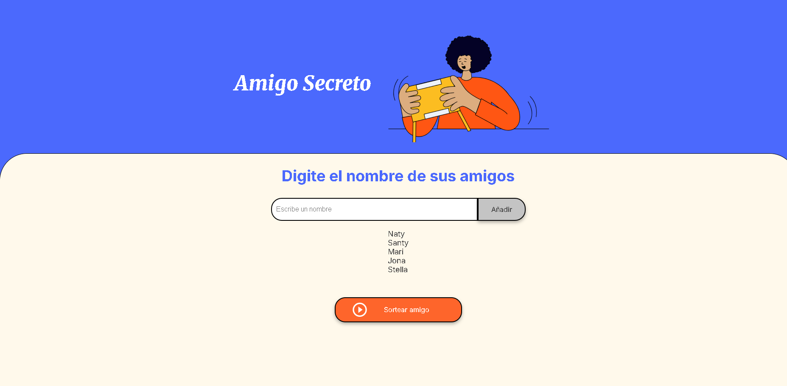
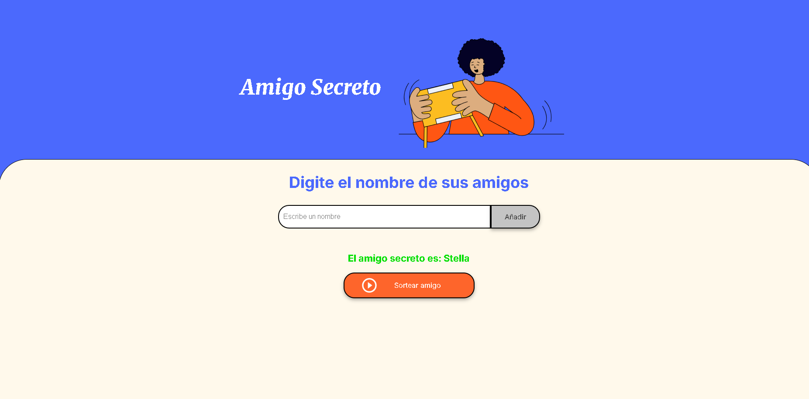

# Amigo Secreto

Este proyecto es un juego sencillo de “Amigo Secreto” desarrollado con HTML, CSS y JavaScript. Permite agregar nombres de amigos, mostrarlos en una lista, y sortear un amigo secreto aleatoriamente.

---

## Uso

Para usar el proyecto, simplemente abrí el archivo `index.html` en tu navegador web preferido. No se requiere instalación ni configuración adicional.

---

## Dependencias

El proyecto está construido con tecnologías web estándar:

- HTML
- CSS
- JavaScript

No utiliza librerías ni frameworks externos.

---

## Capturas de pantalla

A continuación, algunas imágenes del proyecto en funcionamiento:

  
*Pantalla principal donde se agregan los nombres*

  
*Resultado del sorteo mostrando el amigo secreto*

---
